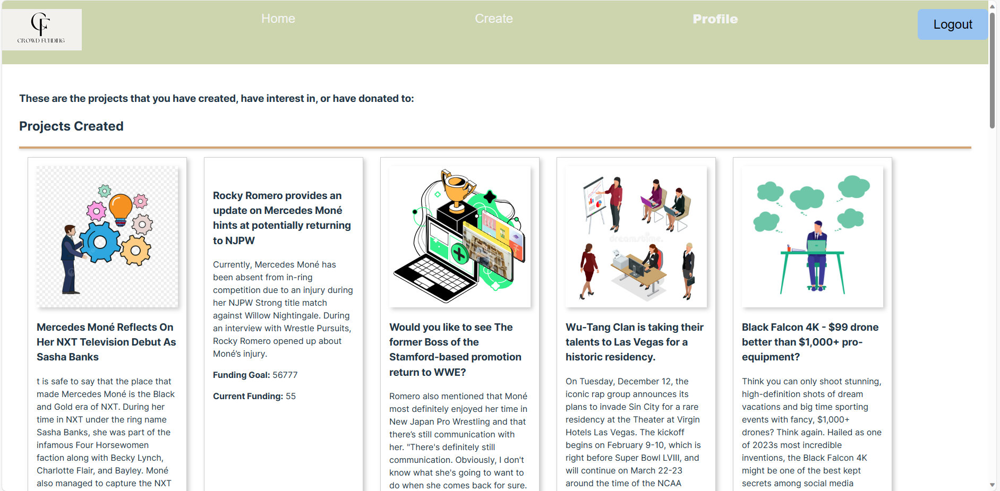
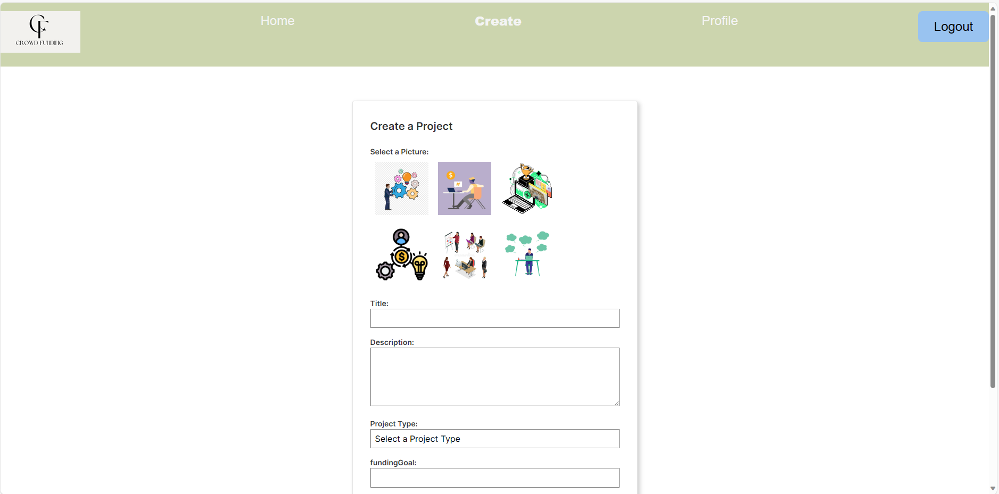

# New Hampshire Crowd Funding

## Description

A website dedicated to helping those with ideas raise the money to make their business dream a reality.

Our platform is more than just a crowdfunding space; its a vibrant ecosystem where creators, backers, and visionaries unite to shape the future. Whether you are an innovator with a groundbreaking project, a supporter seeking the next big thing, or a dreamer looking to be part of something extraordinary.

## Table of Contents

* [Motivation](#motivation) 
  
* [Technologies Used](#technologies-used)  

* [Usage](#usage)

* [Installation](#installation)

* [Demo](#demo) 

* [License](#license)

## Motivation

- As a group, we were motivated to create this project in order to improve our skills creating a full stack MERN application. For all of us, this was our first time really connecting all the pieces and it was a great opportunity to do so as a team.
- We creating this application to work on our skills particularly with React, Node.js, Express.js, and MongoDB. I think connecting all the pieces was great for us to understand the best way to work as a team while creating the application.
- By creating this application, we solved the issue of learning how MERN applications are created as well as created a place where users can go to invest in companies they have interest in.
- Through doing this activity, we learned more about creating full stack MERN applications and how to be the most efficient when doing so.

## Technologies Used
- React.js
- Express.js
- Node.js
- MongoDB
- Mongoose
- @apollo/client
- apollo-server-express
- concurrently
- graphQL
- JWT
- bcrypt
- Vite
- Tachyons (for CSS)

## Usage

As mentioned above, users can create an account, login, create project, Donate to a project and also save liked projects!
  
## Installation

- In order to use this application, the user can simply click on the link below and they will be taken right to the application

To install this project locally:
* Start by forking this repository and clone repository to your local machine.
* Open the project in your preffered IDE
* Look at package.json file that specifies dependencies for this project, so be sure to run `npm    install`. This will install all the required packages. 
* To Seed the database, run `npm run seed`
* Invoke application with `npm run develop`

## Demo

- Screenshots of the application:

- Link to the deployed application:
https://boiling-everglades-43085-8252d97053b3.herokuapp.com/signin

## License

* Please refer to the LICENSE in the repo. <a href="https://github.com/SajithAravindan/Book-Search-Engine-MERN/blob/main/LICENSE">(MIT License)</a>
